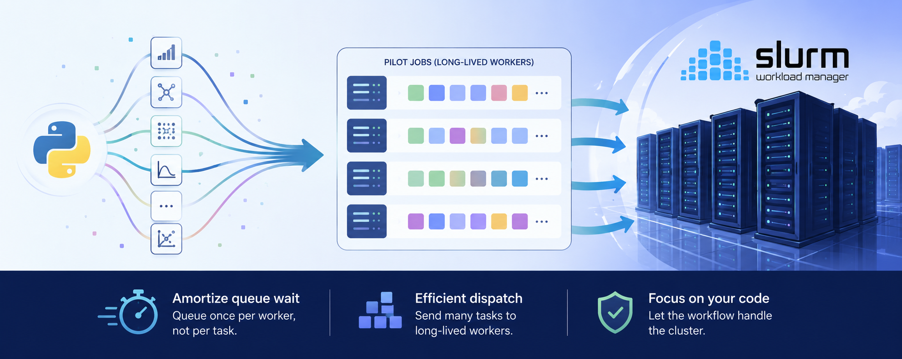

# slurm-workflows: HPC workflow helpers for Slurm clusters.



`slurm-workflows` lets you run Python functions on a Slurm cluster
without writing sbatch scripts by hand.
It provides a [`concurrent.futures`](https://docs.python.org/3/library/concurrent.futures.html)-inspired
interface that launches long-lived **pilot jobs** and dispatches tasks to them,
so Slurm's queueing latency is paid once per worker instead of once per task.

### Features

- **Pilot-job task execution** — pay the queue wait once,
    then dispatch tasks at queue-latency speed.
- **Dynamic scaling** — grow or shrink a pool of workers at runtime
    with `scale_workers`.
- **Stateful actors** — keep expensive per-worker state
    (loaded models, DB connections) warm across many tasks.
- **Transparent serialization** — functions, arguments, and return values
    are [cloudpickled](https://github.com/cloudpipe/cloudpickle),
    so closures and lambdas work.
- **Non-fatal remote errors** — an exception on a worker
    doesn't kill the driver script; it comes back as the task's result.
- **Batch Bayesian optimization** — a [botorch](https://botorch.org/) optimizer
    that proposes a whole batch of points at once
    and evaluates them across the worker pool,
    over mixed integer / float / log-float / categorical spaces.

## Requirements

- Python >= 3.12
- Access to a Slurm cluster (`sbatch`, `squeue`, `scancel` on `PATH`)
- A running [`ds-service`](https://github.com/parantapa/ds-service) server,
  reachable from the login node *and* the compute nodes.
  The client library is installed as a dependency;
  the server is a separate install.

## Installation

```sh
pip install -U slurm-workflows
```

## Concepts

**Setup script.** A shell snippet that every worker runs
    on its compute node before starting.
    This is how your environment (`module load`, `conda activate`)
    reaches the compute node — nothing is inherited from the login node.
    You pass the snippet's **text**, not a path to a file;
    it is inlined into each generated worker script.
    It is optional — omit it if `/etc/profile`,
    which every worker sources first, already suffices.

**Worker group.** A named recipe for a worker:
    sbatch arguments, setup script, optional actor class.
    Defining a group does not launch workers.
    `scale_workers` method is used to start/stop workers.

**Queue.** Tasks are submitted to a named queue,
and **a worker group pulls from the queue matching its own name**.
So `submit("gpu", ...)` is served by workers from the group named `gpu`.

## Quick start

```python
from slurm_workflows import SlurmPilotExecutor, check_for_error

def square(x):
    return x * x

DS_SERVICE_ADDRESS = "HOST-IP:5051"

SETUP_SCRIPT = """
module load gcc/14.2.0
conda activate my-env
"""

# server_address points at your running ds-service instance.
executor = SlurmPilotExecutor(server_address=DS_SERVICE_ADDRESS)

# 1. Describe a kind of worker (nothing is launched yet).
executor.define_worker(
    name="cpu",
    sbatch_args=["-A my_alloc", "-p standard", "--cpus-per-task=4", "-t 01:00:00"],
    setup_script=SETUP_SCRIPT,
)

# 2. Launch 4 pilot jobs of that kind.
executor.scale_workers("cpu", 4)

# 3. Submit tasks to a named queue; workers of that group pull from it.
tasks = [executor.submit("cpu", square, i) for i in range(100)]

# 4. Collect results as they complete (tqdm progress bar included).
for task in executor.as_completed(tasks, desc="squaring"):
    ...  # task.output holds the return value

# Surface any tasks that raised on the worker.
for task in check_for_error(tasks):
    print(task.task_id, task.output.error_id)

# 5. Cancel all pilot jobs when done.
executor.close()
```

`sbatch_args` are passed straight through to `sbatch`,
so any Slurm option works.
`submit` returns immediately with a `Task` handle;
`as_completed(tasks)` (or `wait(tasks)`) blocks until results are ready.

If you keep your setup snippet in a file, read it in yourself:

```python
from pathlib import Path

executor.define_worker(..., setup_script=Path("setup.sh").read_text())
```

You don't have to wait for workers before submitting ---
tasks queue up and are picked up as pilot jobs start running.

### Stateful actors

To keep per-worker state warm across tasks,
register an actor class by its importable name.
Each worker instantiates it once at startup,
and you dispatch **method names** (as strings) instead of functions:

```python
# my_pkg/model.py
class Model:
    def __init__(self):
        self.model = load_expensive_model()   # runs once per worker

    def predict(self, x):
        return self.model(x)

    def close(self):                           # optional cleanup hook
        self.model.release()
```

```python
executor.define_worker(
    name="gpu",
    sbatch_args=["-A my_alloc", "-p gpu", "--gres=gpu:1", "-t 02:00:00"],
    setup_script=SETUP_SCRIPT,
    actor_class_name="my_pkg.model.Model",
)
executor.scale_workers("gpu", 2)

tasks = [executor.submit("gpu", "predict", item) for item in dataset]
executor.wait(tasks)
```

The class must be importable on the compute node.
By default the executor's current working directory
is added to the workers' `sys.path`; add more with `python_paths=[...]`.

### One worker per job, or one per task

`is_batch_worker` controls how many worker processes each Slurm job starts:

| Setting | Script is run with | Workers per job |
| --- | --- | --- |
| `is_batch_worker=False` (default) | `srun` | one per Slurm task in the allocation |
| `is_batch_worker=True` | sourced directly | one, on the batch node |

So with the default, `--nodes=4 --ntasks-per-node=2`
gives you 8 worker processes from a single `scale_workers(..., 1)` call.
Use `is_batch_worker=True` when you want a single process
that owns the whole allocation (e.g. an MPI-style or whole-node job).

### Running the task-queue server

The executor and workers communicate only through a `ds-service` server
— they never talk to each other directly.
You can start one on the login node:

```python
from ds_service_client import DsServiceServer
from slurm_workflows import SlurmPilotExecutor

with DsServiceServer(host="0.0.0.0", port=5051) as ds:
    ds.wait_until_ready()      # blocks until it accepts connections

    executor = SlurmPilotExecutor(
        server_address=ds.get_address_by_interface("ib0")
    )
    ...
```

`DsServiceServer` comes from the `ds-service-client` package,
and the constructor spawns the process,
so the server is already coming up when it returns.
Call `wait_until_ready()` before handing the address to anything —
a client that connects too early
lands in a gRPC reconnect backoff and is slow to recover.
Omit `port` to get an arbitrary free one.

The server must be reachable from the compute nodes,
so bind it to an address the workers can route to (`0.0.0.0` above),
and pass workers a routable host
— a login node's cluster-internal IP, not `localhost`.
`get_address_by_interface("ib0")` picks that node's Infiniband address;
if the interface isn't there it warns and falls back to `127.0.0.1`,
which compute nodes cannot reach, so treat that warning as an error
rather than letting the workers fail to connect later.

`ds_service_bin` (or the `DS_SERVICE_BIN` environment variable)
sets how the server is started, and may be a whole command line
— `apptainer run ds-service.sif` works as well as a path to a binary.

## Batch Bayesian optimization with botorch

`slurm_workflows.bayes_opt_botorch` fits one Gaussian process
to everything measured so far and asks for a *batch* of points at once,
chosen jointly so they do not stack on the same spot —
the shape a pilot pool wants.
It spans mixed integer / float / log-float / categorical spaces,
and evaluates each round across the worker pool.

See **[Batch Bayesian optimization with botorch](docs/bayesian-optimization-using-botorch.md)**
for the full walkthrough: the two phases, search-space types, and the API.

## API reference

Import from the package root:
`from slurm_workflows import SlurmPilotExecutor, check_for_error`.
(The botorch optimizer is the exception:
it lives in `slurm_workflows.bayes_opt_botorch`,
so that the package keeps working without botorch installed.)

### `SlurmPilotExecutor(server_address, work_dir=None)`

`server_address` is the `host:port` of the `ds-service` server.
`work_dir` defaults to a timestamped directory under the platform cache dir
(`XDG_CACHE_HOME`-driven on Linux); generated scripts and all logs land there.

| Method | Purpose |
| --- | --- |
| `define_worker(name, sbatch_args, ...)` | Register a worker group. Idempotent — redefining a group identically is a no-op, redefining it differently asserts. |
| `scale_workers(name, count)` | Submit or cancel pilot jobs so the group has `count` jobs. |
| `submit(queue, fn, *args, **kwargs) -> Task` | Enqueue a task. `queue` is a group name or a list of them; `fn` is a callable, or a method name (`str`) for actor workers. |
| `as_completed(tasks, desc=None, unit="task")` | Yield tasks as their results arrive, wrapped in a tqdm bar. |
| `wait(tasks, desc=None, unit="task")` | Same, but discards the iterator — just block until all are done. |
| `num_groups()` / `num_workers(detail=False)` | Counts of defined groups and submitted workers; `detail=True` returns a per-group dict. |
| `stop()` | Cancel all pilot jobs, keep the executor usable. |
| `close()` | Cancel all pilot jobs and close the queue-server connection. |

Remaining `define_worker` options:

| Argument | Default | Meaning |
| --- | --- | --- |
| `setup_script` | `""` | Shell snippet run on the compute node before the worker starts — the text, not a path. Must be a `str`; omit it (or pass `""`) if `/etc/profile` (always sourced) already gives workers the right environment. |
| `is_batch_worker` | `False` | See [above](#one-worker-per-job-or-one-per-task). |
| `actor_class_name` | `None` | Fully qualified class name to instantiate once per worker. |
| `python_paths` | `None` | Extra paths prepended to the workers' `sys.path`. |
| `add_cwd_to_python_path` | `True` | Also add the coordinator's cwd. |
| `worker_exe` | `"slurm-pilot-worker"` | Worker entry point, if you've wrapped or renamed it. |

### `Task`

`submit` returns a `Task` with `task_id`, `queue`, `priority`, `function`,
`input`, and `output`. `output` is a sentinel until the task completes; after
that it holds the return value — or a `RemoteExecutionError(error, error_id)`
if the worker raised.

### `check_for_error(tasks, verbose=True)`

Returns the subset of `tasks` whose `output` is a `RemoteExecutionError`,
printing each one's `error` and `error_id` unless `verbose=False`.

### Worker environment

Inside a task, these environment variables are set:

- `PILOT_WORKER_NAME` — e.g. `slurm_pilot_worker.cpu.0`
- `PILOT_WORKER_GROUP` — the group name
- `DS_SERVER_ADDRESS` — the queue server address
- plus the usual Slurm variables (`SLURM_JOB_ID`, …)

| Process | Runs on | Role |
| --- | --- | --- |
| Coordinator (`SlurmPilotExecutor`) | login node | defines worker groups, scales pilot jobs, submits tasks |
| `ds-service` | login node (or elsewhere) | holds tasks on named queues |
| Pilot workers | compute nodes | pull tasks, execute them, return results |

`scale_workers` renders a shell script and an sbatch wrapper
from Jinja templates and submits them.
Each job sources your setup script and launches `slurm-pilot-worker`,
which loops forever: fetch a task from its group's queue,
cloudpickle-load the function, run it, post the cloudpickled result back.

Two details worth knowing:

- **Exceptions are values.** A task that raises on a worker
 does not propagate to the coordinator.
 The worker catches it, logs the traceback under a generated `error_id`,
 and returns a `RemoteExecutionError` as the task's `output`.
 Always run `check_for_error` over a completed batch.
- **Submitting from inside a job works.** `sbatch` is invoked
    with all `SLURM_*` / `SLURMD_*` / `PMI_*` / `SRUN_*` variables
    stripped from the environment,
    so a coordinator running inside a Slurm allocation
    can still submit pilot jobs.

## Logs and troubleshooting

Everything for a run lives under the executor's `work_dir`
(printed as `executor.work_dir`):

| File | Contents |
| --- | --- |
| `coordinator.log` | Worker submission and cancellation from the executor's side |
| `<worker-name>.sh`, `<worker-name>.sbatch` | The generated scripts — read these first when a job dies immediately |
| `<worker-name>-<jobid>-<task>.out` | One per worker process: setup-script trace, task-by-task progress, full tracebacks |
| `<worker-name>-<jobid>.out` | The batch job's own output |

Slurm writes those files; the worker process doesn't redirect its own output.
Which of the two you want depends on how the group was defined:

- **`is_batch_worker=False`** (the default) runs the worker under `srun`, which
    fans out over every task in the allocation. Each task gets
    `--output <work-dir>/<worker-name>-%j-%t.out`, so `<task>` is the task's
    rank — that file is the worker's log. Without the per-task `--output` all
    of them would interleave into the single batch file.
    `<worker-name>-<jobid>.out` then holds only what the batch script itself
    emitted, which in practice means `srun`'s own errors.
- **`is_batch_worker=True`** runs one worker directly on the batch node, with
    no `srun` and so no per-task file. Everything lands in
    `<worker-name>-<jobid>.out`.

The `error_id` inside a `RemoteExecutionError` appears verbatim next to the
traceback — grep for it across the work dir to find the failing task's stack.

Common failure modes:

- **Tasks never complete, jobs are running.**
    The queue name doesn't match a worker group name,
    or the workers can't reach `ds-service` from the compute nodes.
    Check the worker's `-<jobid>-<task>.out` file.
- **Jobs start and exit within seconds.**
    The setup script failed. It runs inside the worker script, so its trace is
    in the same `.out` file as the worker's log — not the batch one.
- **`ModuleNotFoundError` on a worker.**
    The module isn't importable on the compute node
    — add `python_paths=[...]` or install it into the environment the setup script activates.

## License

MIT — see [LICENSE](LICENSE).
